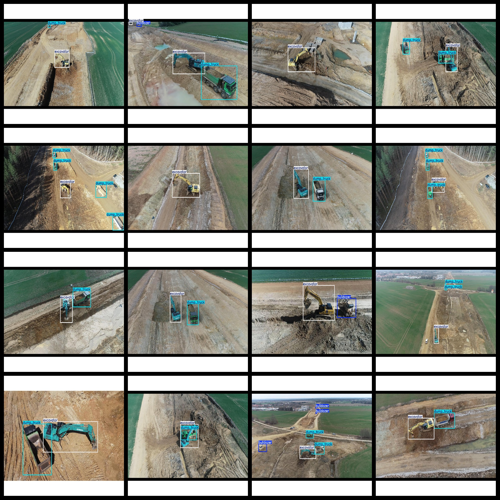

# Aerial 3 types Engineering Vehicle Dataset 1040 images VOC+YOLO format

The aerial 3 types engineering vehicle dataset consists of 1040 images in the VOC+YOLO format. The dataset is organized according to Pascal VOC specifications, but does not include split paths for txt files. Instead, it only includes jpeg images and corresponding VOC-formatted xml files as well as yolo-formatted txt files.

The number of images (jpg files) is 1040.

The number of annotations (xml files) is also 1040.

The number of annotations (txt files) is 1040.

There are 3 categories of annotations: ["bulldozer", "dump_truck", "excavator"].

Please note that the order of categories in the yolo-formatted annotation file does not match this list, but rather follows the labels folder's classes.txt file.

The label Chinese translations are: bulldozer, dump truck, excavator.

The box numbers for each category are as follows:

bulldozer = 196

dump_truck = 1112

excavator = 1070

Total box numbers = 2378

The number of images per category is as follows:

bulldozer = 160

dump_truck = 753

excavator = 1027

The image resolution is 1280x960.

Annotation tools used are labelImg.

Whether the dataset has been enhanced is not specified.

Annotation rules: draw rectangles around the categories.

Important notice: The dataset does not have been divided into training, validation, or test sets; users must divide them themselves.

Special declaration: This dataset does not guarantee any precision of models trained or weight files.

Annotation and image conditions are as follows:

## Images

---

Here is a pay link on Stripe (https://buy.stripe.com/3cs8yP7sY87d0vu9AB). Please contact me lonlonago@foxmail.com after funding $89, and I will send you a complete data files, thank you!

